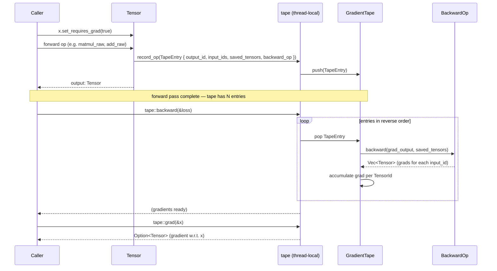
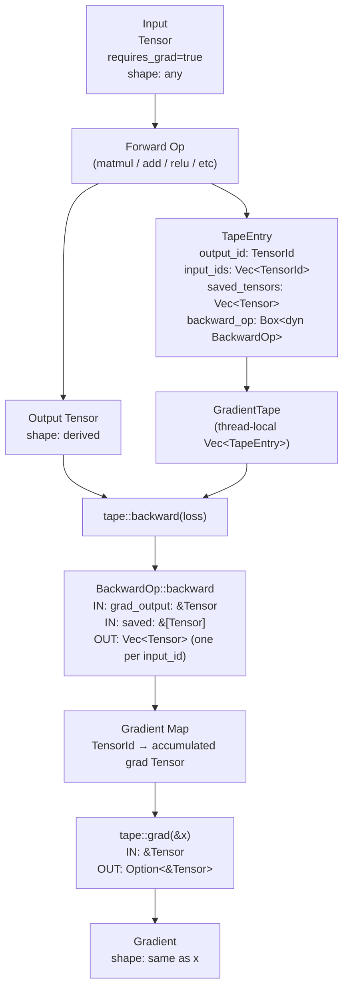

# mlautograd Architecture

## Overview

`mlautograd` is a single-crate automatic differentiation engine for Rust. It wraps `llmtensor`'s `CoreTensor` with a unique identity and gradient flag, records forward operations on a thread-local gradient tape, and replays them in reverse order to compute exact gradients. All state (tape, buffer pool) is thread-local, making the engine naturally safe for multi-threaded training where each thread owns its own forward/backward context.

## Stakeholders & Concerns

| Stakeholder | Concerns |
|-------------|----------|
| Consumers (mllayers, mloptim, mltraining) | Correct gradients, low allocation overhead in the backward pass, predictable `no_grad` semantics for inference |
| Maintainers | Adding new backward ops without touching existing code, zero unsafe footprint in the AD logic, clear separation between tape bookkeeping and gradient math |
| Library end users | Simple API — set `requires_grad`, run forward, call `backward`, read `grad` |

## Component Diagram

```
┌─────────────────────────────────────────────────────────┐
│                        mlautograd                       │
│                                                         │
│  ┌──────────┐   ┌───────────┐   ┌────────────────────┐  │
│  │  tensor  │──▶│   tape    │──▶│     gradient       │  │
│  │          │   │           │   │                    │  │
│  │ Tensor   │   │ Gradient  │   │ AddBackward        │  │
│  │ TensorId │   │   Tape    │   │ MatMulBackward     │  │
│  │          │   │ BackwardOp│   │ MulBackward        │  │
│  │          │   │ TapeEntry │   │ ReLUBackward       │  │
│  └──────────┘   │           │   │ SigmoidBackward    │  │
│                 │ record_op │   │ SoftmaxBackward    │  │
│  ┌──────────┐   │ backward  │   │ TanhBackward       │  │
│  │   pool   │   │ grad      │   │ unbroadcast        │  │
│  │          │◀──│ no_grad   │   └────────────────────┘  │
│  │ Vec<f32> │   │ clear_tape│                           │
│  │  buffers │   └───────────┘                           │
│  └──────────┘                                           │
│                                                         │
│  ┌───────────┐                                          │
│  │  error    │   MlError / MlResult                     │
│  └───────────┘                                          │
└─────────────────────────────────────────────────────────┘
         │
         ▼
    llmtensor (CoreTensor — external dep)
```

## Layer Responsibilities

| Module | Responsibility | Key Types | Dependencies |
|--------|---------------|-----------|--------------|
| `tensor` | Wraps `llmtensor::Tensor` with a stable `TensorId` and a `requires_grad` flag. Delegates all numeric ops to the underlying `CoreTensor`. | `Tensor` | `tensor_id`, `llmtensor` |
| `tensor_id` | Provides monotonically increasing IDs via an atomic counter. Used by the tape to key gradient accumulators. | `TensorId` | none |
| `tape` | Thread-local `GradientTape`. Exposes free functions (`record_op`, `backward`, `grad`, `no_grad`, `is_recording`, `clear_tape`) so callers never touch the tape struct directly. | `GradientTape`, `BackwardOp`, `TapeEntry` | `tensor`, `pool`, `gradient` |
| `pool` | Thread-local `Vec<f32>` buffer pool. Backward ops borrow pre-allocated buffers to avoid per-op heap allocation during the backward pass. | buffer pool (no public type) | none |
| `gradient` | Built-in implementations of `BackwardOp` for the core differentiable ops. Each struct captures the inputs/outputs needed to compute its contribution and calls `unbroadcast` for broadcast-aware accumulation. | `AddBackward`, `MatMulBackward`, `MulBackward`, `ReLUBackward`, `SigmoidBackward`, `SoftmaxBackward`, `TanhBackward` | `tape`, `pool`, `tensor` |
| `error` | Shared `MlError` enum and `MlResult<T>` alias used across the stack. | `MlError`, `MlResult` | `thiserror` |

## Data Flow

```
  Caller
    │
    │  x.set_requires_grad(true)
    │
    ▼
┌──────────┐  forward op   ┌─────────────┐
│  Tensor  │──────────────▶│  tape::     │
│  (input) │               │  record_op  │
└──────────┘               └──────┬──────┘
                                  │ pushes TapeEntry { op: Box<dyn BackwardOp>, ... }
                                  ▼
                         ┌────────────────┐
                         │ GradientTape   │
                         │ (thread-local) │
                         └───────┬────────┘
                                 │
    tape::backward(&loss)        │
    ──────────────────────────── │
                                 │ iterates entries in reverse
                                 ▼
                    ┌────────────────────────┐
                    │  BackwardOp::backward  │◀── pool (scratch buffers)
                    │  (e.g. AddBackward)    │
                    └───────────┬────────────┘
                                │ accumulates into grad map
                                ▼
                    ┌────────────────────────┐
                    │   tape::grad(&x)       │
                    │   returns Option<&T>   │
                    └────────────────────────┘
                                │
                                ▼
                            Caller
```

## Sequence Diagram



## Dataflow Diagram



## Design Decisions

**Thread-local tape over a shared tape.**
Each thread owns its forward/backward context. This avoids lock contention during parallel data-parallel training and makes the API naturally re-entrant. Callers that need cross-thread gradient aggregation must do so explicitly (all-reduce on parameter grads).

**`BackwardOp` as a trait object.**
`Box<dyn BackwardOp>` in `TapeEntry` lets new ops be added in any downstream crate without modifying the tape internals. The cost is a vtable dispatch per op during backward, which is negligible compared to the tensor math.

**Buffer pool for backward allocations.**
The gradient math requires temporary `Vec<f32>` allocations (e.g., intermediate products in `MatMulBackward`). Re-using pooled buffers cuts allocator pressure in long backward passes without unsafe code.

**`unbroadcast` helper in `gradient`.**
PyTorch-style broadcasting means a scalar or smaller-rank tensor can participate in ops with a larger tensor. `unbroadcast` collapses the accumulated gradient back to the original shape, keeping individual `BackwardOp` implementations shape-agnostic.

**No global autograd graph.**
The tape is a flat `Vec<TapeEntry>` in execution order. This is simpler to implement and debug than a DAG, and sufficient for the current stack's training patterns (single forward pass, single backward pass per step).

## Integration Points

| System | Integration | Notes |
|--------|-------------|-------|
| `llmtensor` | `Tensor` wraps `llmtensor::Tensor` (aliased as `swe-ml-tensor`) for all numeric storage and computation | pinned to rev `3f2fb98` |
| `mllayers` | Imports `Tensor`, `tape`, `BackwardOp`, `TapeEntry` to record layer forward passes and define layer backward ops | consumer |
| `mloptim` | Reads parameter gradients via `tape::grad`, writes updated values back into `Tensor` | consumer |
| `mltraining` | Calls `tape::backward` to drive the training loop; calls `tape::clear_tape` between steps | consumer |

## See Also

- [Overview](../README.md)
- [Integration Guide](integration.md)
