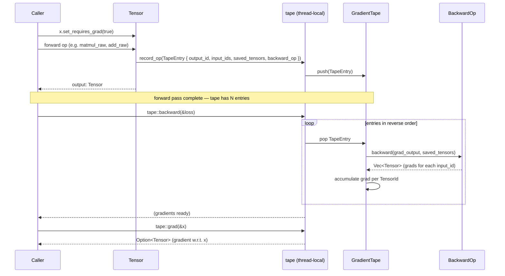
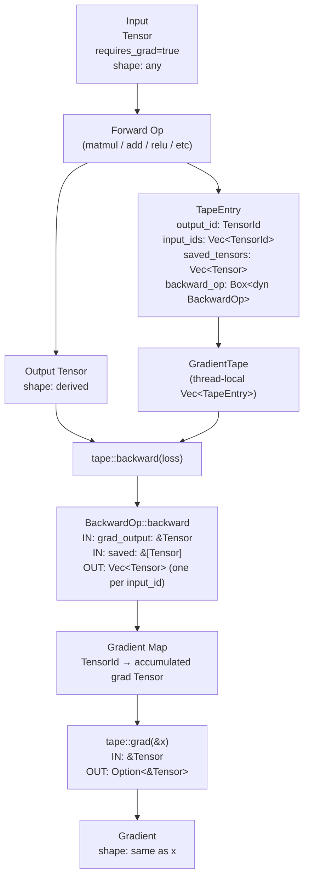

# mlautograd Architecture

## Overview

`mlautograd` is a single-crate automatic differentiation engine for Rust. It wraps `llmtensor`'s `CoreTensor` with a unique identity and gradient flag, records forward operations on a thread-local gradient tape, and replays them in reverse order to compute exact gradients. All state (tape, buffer pool) is thread-local, making the engine naturally safe for multi-threaded training where each thread owns its own forward/backward context.

## Stakeholders & Concerns

| Stakeholder | Concerns |
|-------------|----------|
| Consumers (mllayers, mloptim, mltraining) | Correct gradients, low allocation overhead in the backward pass, predictable `no_grad` semantics for inference |
| Maintainers | Adding new backward ops without touching existing code, zero unsafe footprint in the AD logic, clear separation between tape bookkeeping and gradient math |
| Library end users | Simple API — set `requires_grad`, run forward, call `backward`, read `grad` |

## Component Diagram

```
┌──────────────────────────────────────────────────────────────────┐
│                           mlautograd                             │
│                                                                  │
│  ┌─────────────────────────────────────────────────────────────┐ │
│  │  api/  (public traits, value objects, error types)          │ │
│  │                                                             │ │
│  │  error.rs       MlError, MlResult                          │ │
│  │  tensor_id.rs   TensorId                                   │ │
│  │  tensor.rs      Tensor                                     │ │
│  │  backward_op.rs BackwardOp (trait)                         │ │
│  │  tape_entry.rs  TapeEntry                                  │ │
│  └─────────────────────────────────────────────────────────────┘ │
│                              │ (used by)                         │
│                              ▼                                   │
│  ┌─────────────────────────────────────────────────────────────┐ │
│  │  core/  (implementations — not re-exported from lib.rs)     │ │
│  │                                                             │ │
│  │  gradient_tape.rs   GradientTape (internal) + free fns:    │ │
│  │                     record_op, backward, grad, set_grad,   │ │
│  │                     no_grad, clear_tape, is_recording       │ │
│  │  pool.rs            thread-local Vec<f32> buffer pool      │ │
│  │  gradient/          BackwardOp impls:                      │ │
│  │    add.rs           AddBackward, unbroadcast               │ │
│  │    matmul.rs        MatMulBackward                         │ │
│  │    mul.rs           MulBackward                            │ │
│  │    relu.rs          ReLUBackward                           │ │
│  │    sigmoid.rs       SigmoidBackward                        │ │
│  │    softmax.rs       SoftmaxBackward                        │ │
│  │    tanh.rs          TanhBackward                           │ │
│  └─────────────────────────────────────────────────────────────┘ │
│                              │ (re-exported by)                  │
│                              ▼                                   │
│  ┌─────────────────────────────────────────────────────────────┐ │
│  │  saf/  (sole public factory / re-export surface)            │ │
│  │                                                             │ │
│  │  mod.rs   re-exports free fns + BackwardOp impls           │ │
│  │           GradientTape intentionally omitted               │ │
│  └─────────────────────────────────────────────────────────────┘ │
└──────────────────────────────────────────────────────────────────┘
         │
         ▼
    llmtensor (CoreTensor — external dep)
```

## Layer Responsibilities

| Layer | Modules | Responsibility | Key Types | Dependencies |
|-------|---------|---------------|-----------|--------------|
| `api` | `error`, `tensor_id`, `tensor`, `backward_op`, `tape_entry` | Public traits, value objects, and error types. No dependency on `core`. Defines the shared language used across all three layers. | `MlError`, `MlResult`, `TensorId`, `Tensor`, `BackwardOp`, `TapeEntry` | `llmtensor`, `thiserror` |
| `core` | `gradient_tape`, `pool`, `gradient/*` | Concrete implementations. `gradient_tape` holds the thread-local `GradientTape` and all free functions that drive the forward/backward lifecycle. `pool` manages the thread-local `Vec<f32>` buffer pool. `gradient/` contains each `BackwardOp` impl. None of these are re-exported directly from `lib.rs`. | `GradientTape` (internal), buffer pool (no public type), `AddBackward`, `MatMulBackward`, `MulBackward`, `ReLUBackward`, `SigmoidBackward`, `SoftmaxBackward`, `TanhBackward` | `api` |
| `saf` | `mod.rs` | Sole public factory and re-export surface. Surfaces the free functions and `BackwardOp` implementations that consumers need. `GradientTape` and `pool` are intentionally withheld. | (re-exports from `core`) | `core`, `api` |

## Data Flow

```
  Caller
    │
    │  x.set_requires_grad(true)
    │
    ▼
┌──────────┐  forward op   ┌─────────────┐
│  Tensor  │──────────────▶│  tape::     │
│  (input) │               │  record_op  │
└──────────┘               └──────┬──────┘
                                  │ pushes TapeEntry { op: Box<dyn BackwardOp>, ... }
                                  ▼
                         ┌────────────────┐
                         │ GradientTape   │
                         │ (thread-local) │
                         └───────┬────────┘
                                 │
    tape::backward(&loss)        │
    ──────────────────────────── │
                                 │ iterates entries in reverse
                                 ▼
                    ┌────────────────────────┐
                    │  BackwardOp::backward  │◀── pool (scratch buffers)
                    │  (e.g. AddBackward)    │
                    └───────────┬────────────┘
                                │ accumulates into grad map
                                ▼
                    ┌────────────────────────┐
                    │   tape::grad(&x)       │
                    │   returns Option<&T>   │
                    └────────────────────────┘
                                │
                                ▼
                            Caller
```

## Sequence Diagram



## Dataflow Diagram



## Design Decisions

**Thread-local tape over a shared tape.**
Each thread owns its forward/backward context. This avoids lock contention during parallel data-parallel training and makes the API naturally re-entrant. Callers that need cross-thread gradient aggregation must do so explicitly (all-reduce on parameter grads).

**`BackwardOp` as a trait object.**
`Box<dyn BackwardOp>` in `TapeEntry` lets new ops be added in any downstream crate without modifying the tape internals. The cost is a vtable dispatch per op during backward, which is negligible compared to the tensor math.

**Buffer pool for backward allocations.**
The gradient math requires temporary `Vec<f32>` allocations (e.g., intermediate products in `MatMulBackward`). Re-using pooled buffers cuts allocator pressure in long backward passes without unsafe code.

**`unbroadcast` helper in `gradient`.**
PyTorch-style broadcasting means a scalar or smaller-rank tensor can participate in ops with a larger tensor. `unbroadcast` collapses the accumulated gradient back to the original shape, keeping individual `BackwardOp` implementations shape-agnostic.

**No global autograd graph.**
The tape is a flat `Vec<TapeEntry>` in execution order. This is simpler to implement and debug than a DAG, and sufficient for the current stack's training patterns (single forward pass, single backward pass per step).

## Cross-Cutting Concerns

### Security
- No unsafe code in the AD logic — all tensor math delegates to `llmtensor`
- Thread-local tape means no shared mutable state between threads; no lock needed
- No external input accepted — the engine operates entirely on in-process tensors

### Error Handling
- All fallible ops return `MlResult<T>` — no panics in library code
- `MlError` variants are specific enough to be actionable without exposing internal state
- `tape::backward` is infallible — gradient accumulation errors surface as missing gradients, not panics

### Performance
- Thread-local buffer pool in `core/pool` reuses `Vec<f32>` allocations across backward ops, cutting allocator pressure in long backward passes
- Thread-local tape avoids lock contention in data-parallel training; each thread owns its own forward/backward context
- `tape::no_grad` disables recording entirely — zero overhead for inference paths

## Integration Points

| System | Integration | Notes |
|--------|-------------|-------|
| `llmtensor` | `Tensor` wraps `llmtensor::Tensor` (aliased as `swe-ml-tensor`) for all numeric storage and computation | pinned to rev `3f2fb98` |
| `mllayers` | Imports `Tensor`, `tape`, `BackwardOp`, `TapeEntry` to record layer forward passes and define layer backward ops | consumer |
| `mloptim` | Reads parameter gradients via `tape::grad`, writes updated values back into `Tensor` | consumer |
| `mltraining` | Calls `tape::backward` to drive the training loop; calls `tape::clear_tape` between steps | consumer |

## See Also

- [Overview](../README.md)
- [Integration Guide](integration.md)
